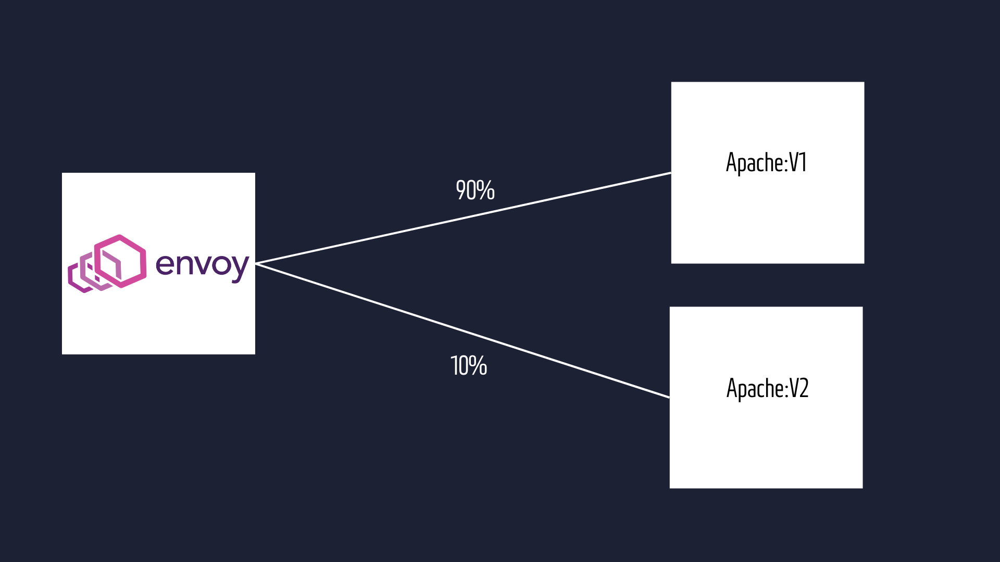

# Istio - Canary deployment 
Canary deployment is a strategy used in software deployment where a new version of an application or service is gradually rolled out to a small subset of users or servers before being deployed to the entire infrastructure. This approach allows developers to test the new version in a real-world environment with limited impact in case of issues or bugs.

The term "canary" refers to the practice of using canaries in coal mines to detect toxic gases. Similarly, in software deployment, the "canary" serves as an early indicator of potential problems.
<hr/>

```
kind: VirtualService
apiVersion: networking.istio.io/v1alpha3
metadata:
  name: web-service
  namespace: istio-demo
spec:
  hosts:      
    - "*"
  gateways:
    - web-gateway 
  http:
    - route:
      - destination:
          host: web-service
          subset: v1
        weight: 90
      - destination:
          host: web-service
          subset: v2
        weight: 10
---
kind: DestinationRule
apiVersion: networking.istio.io/v1alpha3
metadata:
  name: web-service
  namespace: istio-demo
spec:
  host: web-service
  subsets:
    - labels:
        version: v1
      name: v1
    - labels:
        version: v2
      name: v2
```

This configuration sets up Istio to manage traffic for a service named "web-service" in the "istio-demo" namespace. Incoming traffic through the "web-gateway" is directed to different subsets of "web-service" based on defined weights.

Specifically:

90% of traffic is sent to the "v1" subset of "web-service".
10% of traffic is sent to the "v2" subset of "web-service".

Additionally, the DestinationRule defines these subsets ("v1" and "v2") within the "web-service" for load balancing and routing purposes. <br/>


