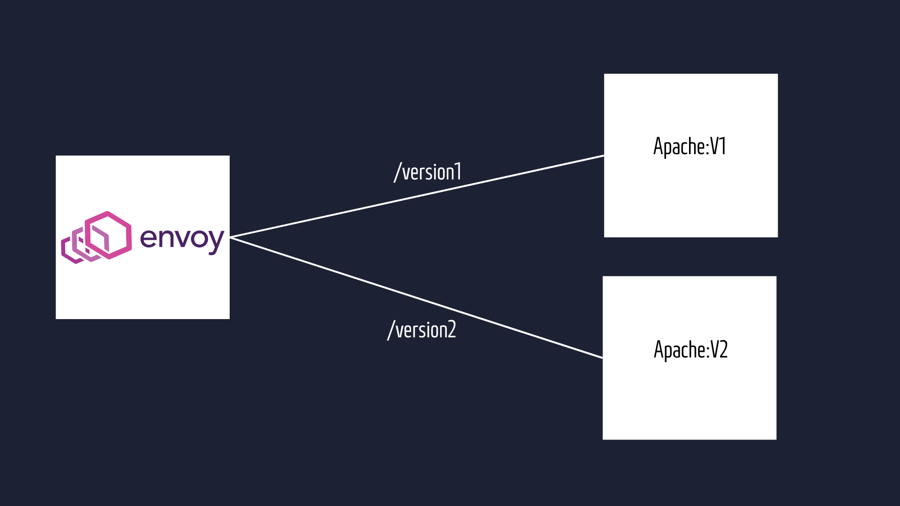

# Istio - Routing

this configuration routes incoming traffic with URI prefixes "/version1" and "/version2" to subsets of the "web-service" service based on the specified routing rules. Requests with "/version1" prefix are directed to subset "v1", while requests with "/version2" prefix are directed to subset "v2". The DestinationRule defines these subsets within the "web-service" service for load balancing and routing purposes.
```
kind: VirtualService
apiVersion: networking.istio.io/v1alpha3
metadata:
  name: web-service
  namespace: istio-demo
spec:
  hosts:      
    - "*"
  gateways:
    - web-gateway
  http:
    - match:
      - uri:  
          prefix: "/version1"
      rewrite:
          uri: /
      route: 
      - destination:
          host: web-service
          subset: v1
    - match:
      - uri :
          prefix: "/version2"
      rewrite:
          uri: /
      route:
      - destination:
          host: web-service
          subset: v2
---
kind: DestinationRule
apiVersion: networking.istio.io/v1alpha3
metadata:
  name: web-service
  namespace: istio-demo
spec:
  host: web-service
  subsets:
    - labels:
        version: v1
      name: v1
    - labels:
        version: v2
      name: v2
```


