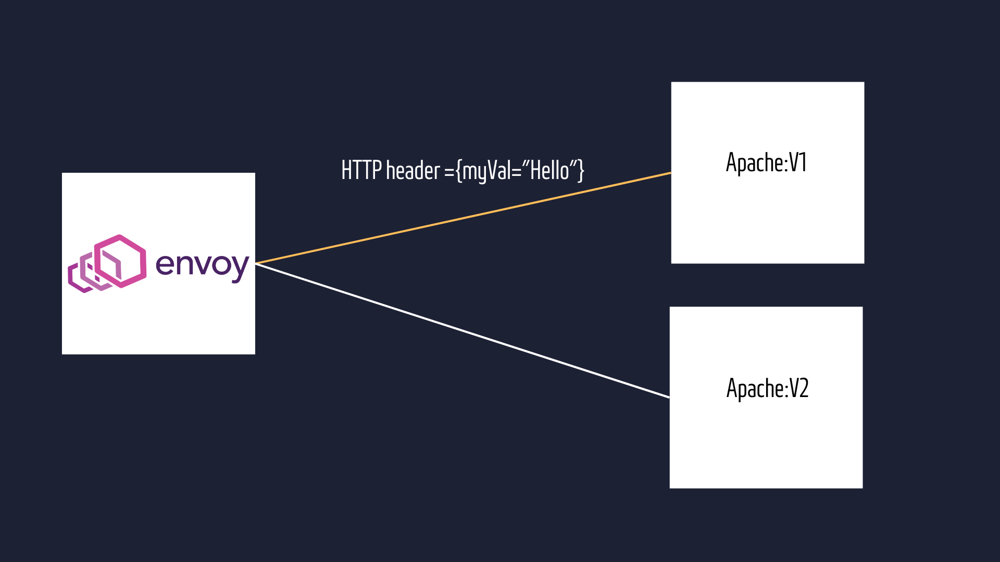

# Istio - Consistent Hashing
Consistent Hashing is a mechanism that will allow you to stick a request to a client by generating a hash internally. So if a user requests user microservice and get response from user:v2 pod then in the subsequent requests will also be forwarded to that user:v2 pod.
<hr/>

```
kind: VirtualService
apiVersion: networking.istio.io/v1alpha3
metadata:
  name: web-service
  namespace: istio-demo
spec:
  hosts:      
    - "*"
  gateways:
    - web-gateway
  http:
    - route:
      - destination:
         host: web-service
         subset: all-version
---
kind: DestinationRule
apiVersion: networking.istio.io/v1alpha3
metadata:
  name: web-service
  namespace: istio-demo
spec:
  host: web-service
  trafficPolicy:
    loadBalancer:
      consistentHash:
        httpHeaderName: "myVal"
  subsets:
    - labels:
        app: httpd
      name: all-version
```

this configuration defines a VirtualService that routes all incoming traffic for any host through the "web-gateway" to a single subset of the "web-service" service labeled as "all-version". The DestinationRule associated with this service sets up consistent hash load balancing based on a custom HTTP header named "myVal", and it defines a single subset labeled as "httpd", suggesting that all versions or variants of the "web-service" application belong to this subset.<br/>


